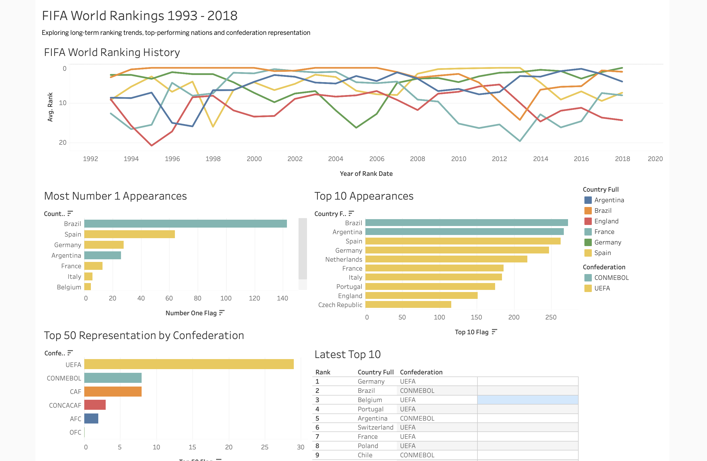
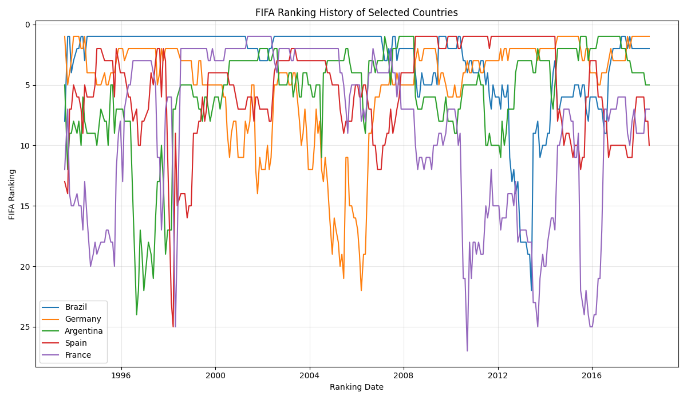

# FIFA World Rankings Analysis

An exploratory analysis of historical FIFA men's world rankings using **Python, pandas, matplotlib and Tableau**.

The project follows a simple end-to-end analytics workflow:

```text
Raw FIFA rankings
        ↓
Data cleaning and preparation
        ↓
Exploratory analysis
        ↓
Python visualisations
        ↓
Interactive Tableau dashboard
```

The aim of the project is to explore long-term international football ranking trends while demonstrating practical skills in **Python, data cleaning, exploratory data analysis, visualisation, Tableau, Git and VS Code**.

---

## Live Dashboard

The completed interactive dashboard is available on Tableau Public:

[View the FIFA World Rankings Dashboard on Tableau Public](https://public.tableau.com/app/profile/gavan.rewt/viz/FIFA_17875763718800/FIFAWorldRankings1993-2018)

## Dashboard Preview


---

## Dataset

The dataset used in this project was sourced from Kaggle:

**FIFA International Soccer Men's Ranking 1993–Now**

[View the dataset on Kaggle](https://www.kaggle.com/datasets/tadhgfitzgerald/fifa-international-soccer-mens-ranking-1993now/data)

The dataset contains historical FIFA men's international ranking information, including:

* Country
* Country abbreviation
* FIFA ranking
* Ranking date
* Total ranking points
* Previous ranking points
* Ranking movement
* Confederation
* Current and historical weighted ranking metrics

The version used in this project contains rankings from **8 August 1993 to 7 June 2018**.

The raw dataset is retained separately from the cleaned version so that the data preparation process remains reproducible.

---

## Project Structure

```text
fifa-ranking-analysis/
│
├── data/
│   ├── raw/
│   │   └── fifa_ranking.csv
│   │
│   └── cleaned/
│       └── fifa_ranking_clean.csv
│
├── outputs/
│   └── charts/
│       ├── number_one_rankings.png
│       ├── top_10_appearances.png
│       └── ranking_history.png
│
├── run.py
├── analysis.py
├── visualisations.py
└── README.md
```

---

# 1. Data Preparation

The first stage of the project focuses on preparing the raw FIFA World Rankings dataset for analysis.

The cleaning process is handled in `run.py` using **Python** and **pandas**.

The purpose of this stage is to create a consistent, analysis-ready dataset that can be reused throughout the rest of the project.

## Cleaning Process

The `run.py` script performs the following steps.

### 1. Load the raw dataset

The raw CSV file is imported using:

```python
pd.read_csv()
```

The number of rows and columns loaded is printed to the terminal.

The raw dataset contains **57,793 rows**.

---

### 2. Check the original data types

Column data types are inspected before making any transformations.

This helps identify fields that require conversion and provides a simple initial validation step.

---

### 3. Convert the ranking date

The `rank_date` column is converted from an object/string field into a pandas datetime field.

```python
df["rank_date"] = pd.to_datetime(
    df["rank_date"],
    errors="coerce"
)
```

Using `errors="coerce"` means invalid dates are converted to missing values instead of causing the script to fail.

---

### 4. Remove invalid dates

Any records where `rank_date` cannot be successfully converted are removed.

---

### 5. Remove duplicate observations

Duplicate records are identified using the combination of:

* `country_full`
* `rank_date`

Only one observation for each country and ranking date is retained.

Following the cleaning process, the dataset contains **57,754 rows**.

---

### 6. Clean text fields

Leading and trailing whitespace is removed from:

* `country_full`
* `country_abrv`
* `confederation`

---

### 7. Create additional date fields

Several fields are created from `rank_date`:

* `year`
* `month`
* `month_name`

These make time-based filtering easier in Python and Tableau.

---

### 8. Create ranking categories

Countries are grouped into ranking bands:

* Top 10
* 11–25
* 26–50
* 51+

These categories make it easier to compare different levels of ranking performance.

---

### 9. Create indicator fields

Additional Boolean fields are created:

* `is_number_one`
* `is_top_10`
* `is_top_50`

These simplify later calculations such as counting how frequently countries appeared at the top of the rankings.

---

### 10. Flag available FIFA points data

A `has_total_points` field identifies records where:

```text
total_points > 0
```

The `total_points` field is not consistently populated throughout the entire historical dataset.

For this reason, **ranking position is used as the primary measure for the long-term analysis**.

---

### 11. Sort the dataset

The cleaned dataset is sorted by:

1. Country
2. Ranking date

This keeps each country's ranking history in chronological order.

---

### 12. Export the cleaned dataset

The final cleaned file is saved to:

```text
data/cleaned/fifa_ranking_clean.csv
```

This file is then used by the Python analysis, visualisations and Tableau dashboard.

---

## Running the Cleaning Script

From the root directory of the project, run:

```bash
python run.py
```

The script prints information including:

* Number of rows loaded
* Original data types
* `rank_date` type before conversion
* `rank_date` type after conversion
* A preview of the cleaned dataset
* Location of the exported CSV

---

# 2. Exploratory Analysis

The second stage uses `analysis.py` to explore the cleaned FIFA rankings dataset.

The analysis focuses on four main questions:

1. Which countries appeared at number one most often?
2. Which countries appeared in the Top 10 most often?
3. Which confederations accumulated the most Top 50 appearances?
4. What did the latest Top 10 ranking in the dataset look like?

---

## Question 1: Which countries appeared at number one most often?

The dataset is filtered to records where:

```text
rank = 1
```

The remaining rows are grouped by country and counted.

This provides a simple measure of historical dominance at the top of the FIFA rankings.

---

## Question 2: Which countries appeared in the Top 10 most often?

The dataset is filtered to countries ranked between 1 and 10.

The number of appearances is then calculated for each country.

This provides a broader measure of sustained ranking performance than simply counting appearances at number one.

---

## Question 3: Which confederations accumulated the most Top 50 appearances?

Records ranked 50 or better are grouped by confederation.

This provides an overview of historical representation among highly ranked teams.

Historical totals should be interpreted carefully because confederations contain different numbers of national teams.

For the Tableau dashboard, the confederation analysis therefore also uses the **latest ranking date** to provide a more intuitive single-date comparison.

---

## Question 4: What did the latest Top 10 ranking in the dataset look like?

The most recent ranking date is identified using:

```python
df["rank_date"].max()
```

The dataset is filtered to this date and sorted by ranking position.

The first ten records provide a snapshot of the highest-ranked teams at the end of the dataset.

---

## Running the Analysis

Run the analysis from the project root using:

```bash
python analysis.py
```

Results are printed directly to the terminal.

---

# 3. Python Visualisations

The `visualisations.py` script creates three supporting charts using **matplotlib**.

The goal of these visualisations is to provide a quick exploratory view of the main findings before moving into Tableau.

### Example Python Visualisation



---

## Chart 1: Countries with Most Number One Appearances

A bar chart compares the countries that appeared at FIFA Rank 1 most frequently.

The analysis involves:

```text
Filter Rank 1 records
        ↓
Group by country
        ↓
Count appearances
        ↓
Sort descending
        ↓
Plot leading countries
```

This chart highlights the national teams that historically dominated the number one ranking.

---

## Chart 2: Countries with Most Top 10 Appearances

A second bar chart shows the countries that appeared inside the FIFA Top 10 most frequently.

This provides a broader measure of long-term consistency and sustained performance.

---

## Chart 3: Ranking History of Selected Countries

A line chart compares the ranking history of:

* Brazil
* Germany
* Argentina
* Spain
* France

The ranking date is plotted on the x-axis and FIFA ranking position on the y-axis.

Because a lower ranking number represents better performance, the y-axis is inverted so that **Rank 1 appears at the top of the chart**.

This makes improvements and declines in ranking easier to interpret visually.

---

## Running the Visualisations

Run:

```bash
python visualisations.py
```

The charts are displayed using matplotlib and saved to:

```text
outputs/charts/
```

The generated files are:

```text
number_one_rankings.png
top_10_appearances.png
ranking_history.png
```

---

# 4. Tableau Dashboard

The final stage of the project uses **Tableau** to create an interactive visual summary of the FIFA rankings.

## FIFA World Rankings: 1993–2018

*Exploring long-term ranking trends, top-performing nations and confederation representation.*

[View the interactive dashboard on Tableau Public](https://public.tableau.com/app/profile/gavan.rewt/viz/FIFA_17875763718800/FIFAWorldRankings1993-2018)

The Tableau workbook uses:

```text
data/cleaned/fifa_ranking_clean.csv
```

as its data source.

---

## Ranking History

The main dashboard visual is a line chart showing FIFA ranking position over time.

The worksheet uses:

```text
Columns: rank_date
Rows: AVG(rank)
Colour: country_full
Marks: Line
```

The ranking axis is reversed so **Rank 1 appears at the top of the chart**.

Country filtering allows individual national teams to be explored over time.

---

## Most Number One Appearances

A bar chart shows the countries that appeared at FIFA Rank 1 most frequently.

A Tableau calculated field is used:

```text
IF [rank] = 1 THEN 1 ELSE 0 END
```

The field is summed by country to calculate total number-one appearances.

---

## Most Top 10 Appearances

A second bar chart shows the countries with the highest number of Top 10 appearances.

The calculated field is:

```text
IF [rank] <= 10 THEN 1 ELSE 0 END
```

This provides a measure of sustained high-ranking performance.

---

## Top 50 Representation by Confederation

The dashboard compares confederation representation within the Top 50 on the final ranking date in the dataset.

This approach was chosen instead of displaying only historical totals, which become very large because each ranking period contributes another observation.

The final-date view provides a clearer snapshot of confederation representation among the world's highest-ranked teams.

---

## Latest Top 10

A table shows the ten highest-ranked teams on the most recent ranking date in the dataset.

The worksheet includes:

* Rank
* Country
* Confederation

The latest ranking date is identified using a Tableau calculated field:

```text
{ FIXED : MAX([rank_date]) }
```

A second field identifies records belonging to that date:

```text
[rank_date] = [Latest Ranking Date]
```

The worksheet is then filtered to ranks 1–10.

---

## Dashboard Interactivity

The dashboard includes filters that allow users to explore ranking history by country.

The summary charts remain largely static so that the overall historical comparisons remain visible while users investigate individual ranking trends.

This keeps the dashboard interactive without causing unrelated visualisations to become overly filtered or difficult to interpret.

---

# 5. Key Findings

The analysis produced several clear findings about FIFA ranking performance between August 1993 and June 2018.

## 5.1 Which countries appeared at number one most often?

**Brazil was the most dominant country at the top of the rankings**, appearing at FIFA Rank 1 on **143 ranking dates**.

| Country     | #1 Appearances |
| ----------- | -------------: |
| Brazil      |            143 |
| Spain       |             64 |
| Germany     |             28 |
| Argentina   |             26 |
| France      |             13 |
| Italy       |              6 |
| Belgium     |              5 |
| Netherlands |              1 |

Brazil recorded more than twice as many number-one appearances as Spain, which ranked second with **64**.

Only **eight countries** reached FIFA Rank 1 during the period covered by the dataset.

This suggests that the very top of the FIFA rankings was concentrated among a relatively small group of national teams.

---

## 5.2 Which countries appeared in the Top 10 most often?

Brazil also recorded the most Top 10 appearances, although the gap was much smaller than for number-one rankings.

| Country        | Top 10 Appearances |
| -------------- | -----------------: |
| Brazil         |                273 |
| Argentina      |                267 |
| Spain          |                263 |
| Germany        |                247 |
| Netherlands    |                218 |
| France         |                186 |
| Italy          |                184 |
| Portugal       |                175 |
| England        |                151 |
| Czech Republic |                116 |

Brazil appeared in the Top 10 on **273 ranking dates**, only six more than Argentina's **267**.

Spain also demonstrated strong long-term consistency with **263 appearances**, followed by Germany with **247**.

France appeared in the Top 10 **186 times** and reached number one on **13 occasions**.

The Netherlands provides an interesting contrast: it reached FIFA Rank 1 only **once**, but recorded **218 Top 10 appearances**.

This demonstrates that reaching number one and maintaining consistent Top 10 performance are related, but they are not the same measure of success.

---

## 5.3 Which confederations had the strongest Top 50 representation?

Across the complete historical dataset, UEFA accumulated the largest number of Top 50 appearances.

| Confederation | Historical Top 50 Appearances |
| ------------- | ----------------------------: |
| UEFA          |                         7,701 |
| CAF           |                         2,386 |
| CONMEBOL      |                         2,036 |
| AFC           |                         1,106 |
| CONCACAF      |                         1,087 |
| OFC           |                             9 |

These totals are affected by both the number of ranking periods and the number of national teams within each confederation.

For this reason, the Tableau dashboard also considers the final ranking date as a single snapshot.

On **7 June 2018**, the FIFA Top 50 contained:

| Confederation | Teams in Top 50 | Share of Top 50 |
| ------------- | --------------: | --------------: |
| UEFA          |              29 |             58% |
| CONMEBOL      |               8 |             16% |
| CAF           |               8 |             16% |
| CONCACAF      |               3 |              6% |
| AFC           |               2 |              4% |
| OFC           |               0 |              0% |

UEFA therefore accounted for **29 of the world's Top 50 teams**, or **58%**, on the final date in the dataset.

CONMEBOL and CAF each contributed **8 teams**, while CONCACAF and AFC had considerably smaller representation.

---

## 5.4 What did the final Top 10 ranking look like?

The final ranking date contained in the dataset is **7 June 2018**.

The Top 10 was:

| Rank | Country     | Confederation |
| ---: | ----------- | ------------- |
|    1 | Germany     | UEFA          |
|    2 | Brazil      | CONMEBOL      |
|    3 | Belgium     | UEFA          |
|    4 | Portugal    | UEFA          |
|    5 | Argentina   | CONMEBOL      |
|    6 | Switzerland | UEFA          |
|    7 | France      | UEFA          |
|    8 | Poland      | UEFA          |
|    9 | Chile       | CONMEBOL      |
|   10 | Spain       | UEFA          |

Germany therefore finished the dataset as the **world's number-one ranked team**, with Brazil second and Belgium third.

France, despite recording **13 historical number-one appearances**, finished the dataset ranked **7th**.

Seven of the final Top 10 teams were members of **UEFA**, while three represented **CONMEBOL**.

---

# 6. Conclusion

The results show that **Brazil was the strongest overall performer across the period covered by this dataset** when considering both dominance at Rank 1 and sustained Top 10 performance.

Brazil recorded **143 number-one appearances** and **273 Top 10 appearances**, leading both measures. Its 143 appearances at number one were more than double Spain's **64**.

Argentina came particularly close to Brazil in terms of long-term consistency, recording **267 Top 10 appearances**, while Spain recorded **263** and Germany **247**.

Germany combined strong historical performance with success at the end of the dataset. It recorded **28 number-one appearances** and finished the final ranking on **7 June 2018 at Rank 1**.

France also demonstrated sustained strength, with **13 appearances at number one** and **186 Top 10 appearances**, before ending the dataset ranked **7th**.

At confederation level, UEFA had the strongest representation in the final ranking snapshot. It accounted for **29 of the Top 50 teams (58%)** and **7 of the final Top 10 teams**.

Overall, the analysis suggests that FIFA's highest ranking positions were dominated by a relatively small group of national teams. At the same time, the ranking-history analysis shows that even the most successful countries experienced substantial rises and falls over the approximately 25-year period covered by the dataset.

The project also demonstrates how Python and Tableau can complement one another within an analytics workflow: **Python was used to clean, validate, transform and explore the data, while Tableau was used to communicate the results through an interactive dashboard.**

---

# 7. Tools and Technologies

The project uses:

* **Python**
* **pandas**
* **matplotlib**
* **Tableau**
* **VS Code**
* **Git**
* **GitHub**

---

# 8. Skills Demonstrated

This project demonstrates practical experience with:

* Data cleaning
* Data validation
* Data type conversion
* Duplicate handling
* Feature engineering
* Datetime manipulation
* pandas filtering
* Grouping and aggregation
* Exploratory data analysis
* Python functions
* matplotlib visualisation
* Time-series visualisation
* Tableau calculated fields
* Tableau filters
* Dashboard design
* Git version control
* Project documentation

---

# 9. Data Source

The original dataset is available from Kaggle:

[FIFA International Soccer Men's Ranking 1993–Now](https://www.kaggle.com/datasets/tadhgfitzgerald/fifa-international-soccer-mens-ranking-1993now/data)

The data is used here for educational and portfolio analysis purposes.

---

## Tableau Public

The final interactive dashboard can be viewed here:

[**FIFA World Rankings: 1993–2018 — Tableau Public**](https://public.tableau.com/app/profile/gavan.rewt/viz/FIFA_17875763718800/FIFAWorldRankings1993-2018)
